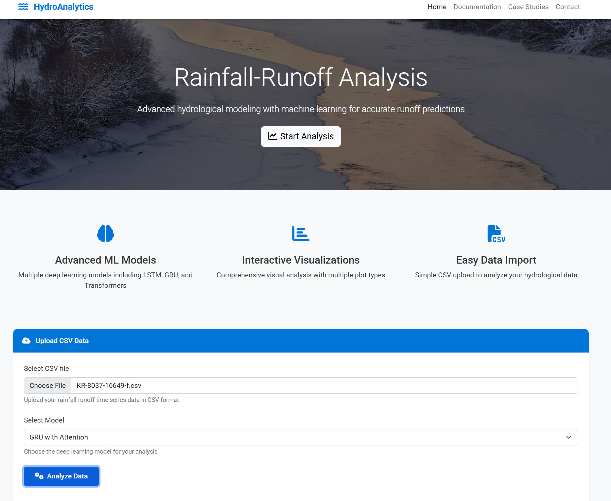
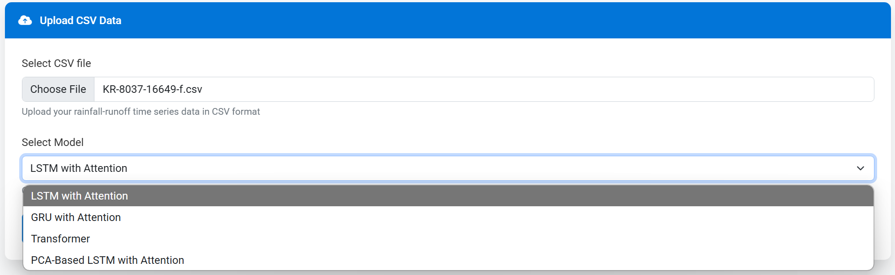
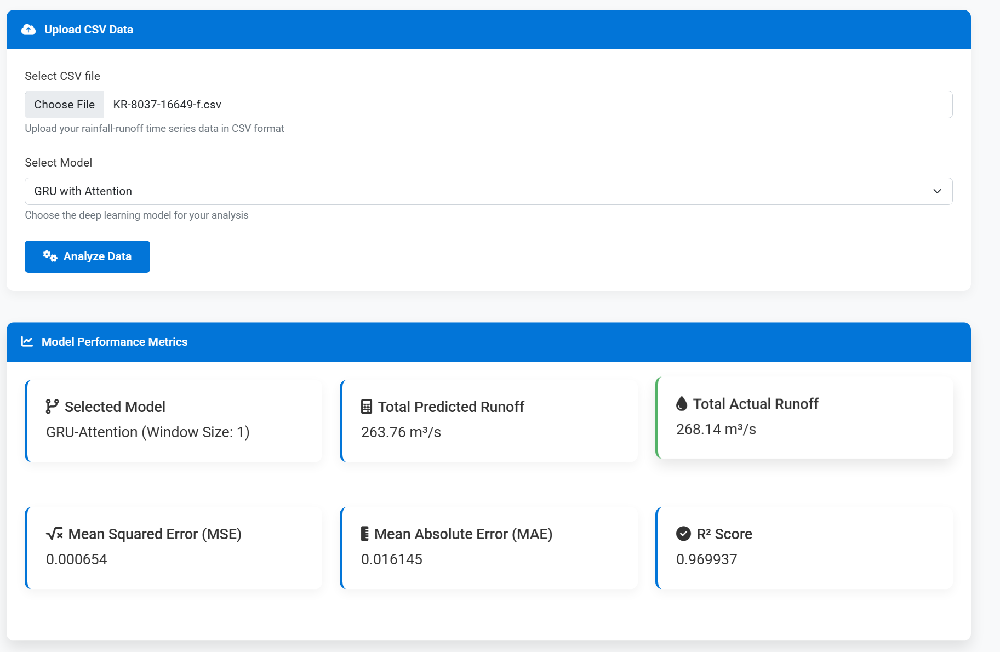

# HydroAnalytics: Rainfall-Runoff Analysis Tool



## Overview

HydroAnalytics is an advanced web-based application for hydrological modeling that leverages machine learning techniques to analyze rainfall-runoff relationships. This tool helps hydrologists, environmental scientists, and water resource engineers to predict runoff from rainfall data with high accuracy using state-of-the-art deep learning models.

## Features

- **Multiple Advanced ML Models**: Choose from LSTM with Attention, GRU with Attention, Transformer, and PCA-Based LSTM models.
- **Interactive Data Visualization**: Comprehensive visual analysis with multiple plot types including line, scatter, bar, and residuals.
- **Simple Data Import**: Upload your time-series data via CSV format.
- **Performance Metrics**: Get detailed model performance metrics including MSE, MAE, and R² Score.
- **Report Generation**: Generate and download analysis reports for documentation and presentation.

## Screenshots

### Homepage


### Configuration Screen


### Analysis Results


### Detailed Visualization


## Installation

### Prerequisites
- Python 3.8+
- Flask
- TensorFlow 2.x
- NumPy, Pandas, Matplotlib
- Bootstrap 5.2.3

### Setup Instructions

1. Clone the repository:
   ```bash
   git clone https://github.com/yourusername/rainfall_runoff.git
   cd rainfall_runoff-main

2. Create and activate a virtual environment:
    ```bash
    python -m venv venv
# On Windows
venv\Scripts\activate
# On macOS/Linux
source venv/bin/activate

3. Install dependencies:

  ```bash
pip install -r requirements.txt

4. Run the application:
  ```bash 
python app.py


5. Open your browser and navigate to:
  ```bash 
  http://localhost:5000